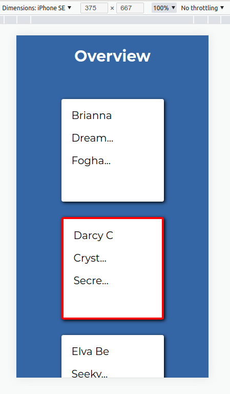

# Game-Card-Assesment

This is an assesment to show skills working with the React.js

The stack used: React | Axios | Json-Server | Styled-Components | Node

### Functionality:

The react app fetches players data from a mockup backend and creates an overview of cards showing information of each player.

If a card is selected, the card gets a red border and the info from the card is displayed in the details-box.

From the control panel, it is possible to sort the cards (ascending and descending). Also is possible to submit the selected player and send its info-details to the mocked server that can be acceded through the url http://localhost:5000/submitedPlayers

The app is designed to be fully responsive to any kind of screens.

The app contains the following:

- Basic modular folder structure:

   - mockedBackend              
   - src/Components: controls, PlayerDatails, PlayerOverview   
   - page                  

- Asynchronously load of the player data in json format, using promises (axios) and useEffect.
 

### How to launch it:

1. Clone this repository
2. From the terminal, from inside of the folder /the-card-game-aoe-assesment, run the following commands:

`npm install`
`npm start`

3. Open a second terminal from the same folder and run:

`json-server --watch mockedBackend/db.json --port 5000`

Thus you will start the mocked backend.

